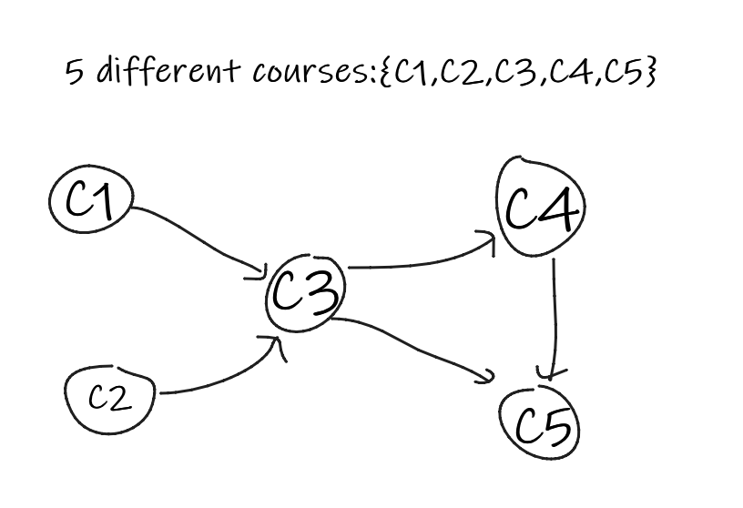

# Cumulation of different algorithms which I may or may not have been analysed

# Unit 1
<h3>Selction Sort</h3>
Given an array of numbers, it gives an output array sorted in ascending order.
The algorithm iterates throught the array and assumes first element as smallest one and compares all elements after that and swaps with the smaller one if exist or else, no swap operation happens.
<br>

```
Algorithm selectionSort(arr[])
// Sort the given array in ascending order
// Input: An array of arr length n
// Output: arr sorted in ascending order
for i<-0 to n-1 do
    min = i
    for j<-i+1 to n do
        if a[j] < min  
            min = a[j]
    swap(a[min],a[i])
```

The basic operation is comparision

```
C(n) = Σ Σ 1 {j=i+1 to n}{i=0 to n-1}
C(n) = Σ n-i-1 {i=0 to n-1}
C(n) = (n-1) + (n-2) + .... + 1
C(n) = (n)(n-1)/2
C(n) belongs to Θ(n^2)
```

<h3> Euclid's algorithm to find the GCD of given two integers. </h3>
The greatest common divisor of two nonnegative, not-both-zero
integers m and n, denoted by gcd(m, n), is defined as the largest integer that divides
both m and n evenly, i.e., with a remainder of zero. Euclid of Alexandria (third
century B.C.) outlined an algorithm for solving this problem. Euclid's algorithm is based on applying repeatedly the equality
<br>

```
gcd(m, n) = gcd(n, m mod n)
```

(where m mod n is the remainder of the division of m by n) until m mod n is equal
to 0; since gcd(m, 0) = m, the last value of m is also the greatest common
divisor of the initial m and n.
For example, gcd(60, 24) can be computed as follows:
gcd(60, 24) = gcd(24, 12) = gcd(12, 0) = 12.


<h3>Sieve of Erathosthenes:</h3>
This is a simple algorithm to generate consecutive prime numbers not exceeding given integer m. The input is a list of integers less than or equal to m. It basically eliminates all the integers in the list which are multiple after which it starts eliminating numbers which are nultiple, this is continued until there are no more numbers in the list which can be eliminated. But there is a problem here which is that 6 is a multiple of both 2 and 3, so eliminating that would be waste of resource. Now if we observe the algorithm carefully we realise that given a number p, its multiples 2p, 3p,.... p(p-1) have been eliminated in previous iterations. So we can use this observation to make sure we do not eliminate the same element again and again. Also p*p cannot exceed the value of n, so we only need to iterate through floor(n) times. So in each iteration, it checks p has already been eliminated, if yes, then it loops through, if not then it, marks all the multiples of p as eliminated. Finally it copies all the unmarked elements onto a new array which will be the list of prime numbers less than m.

```
Algorithm Sieve(n)
// Find all the prime numbers less than or equal to n
// Input: integer n 
// Output: list of all prime numbers less than n
for(p=2;p<n;p++){
    A[p]=i;
}
for(p=2;p*p<n;p++){
    if(A[p]!=0){
        j=p*p;
        while(j<=n){
            A[j]=0;
            j+=p;
    }
    }
    
}
```
<br> 

<h2>Non Recursive Algorithms</h2>
<h3>Max element in an array</h3>
This algorithm is used to determine the largest element in a given array.
Assume first element in the array is the largest element and store it in a variable "max".
Iterate through the array and compare it with each element, if the element in array is greater, replace max with that value.

```
Algorithm Maxval(arr[1,.....n-1])
// Determine the largest element in a given array.
// Input: An array A[0......n-1] of real numbers
// Output: Largest element in the given array.

for i<- 1 to n-1 do
 if(A[i]>maxval){
    maxval = A[i]
}
return maxval
```
<br>
Basic operation in this is comparision which is done n times.
<br>

```
t(b) = Σ 1[1->n-1]
t(b) = n-1-1+1
t(b) = n-1
n-1 belongs to Θ(n)
```

<h3>Unique elements</h3>
The goal of this algorithm is to check if all elements in a given array are distinct or not.

```
Algorithm Unique(A[0,....n-1])
// Determine whether all elements in a given array are distinct or not
// Input: Array A[0,....n-1]
// Output: Returns 1 if all are distince, else 0
for i<0 to 2 do
    for j<i+1 to n-1 do
        if A[i]==A[j] return 1
return 0
```
Comparision is the basic operation, done over two for loops.
<br>

```
t(n) = Σ Σ (1){j=i+1 to n-1}{i=0 to n-2}
t(n) = Σ n-1-i-1+1{i=0 to n-2}
t(n) = n-1 + n-2 + n-3 ..... +1
t(n) = n(n-1)/2 
n(n-1)/2 belongs to Θ(n*n)
```

<h3>Matrix Multiplication</h3>

```
Algorithm MatMul(A[0.....n-1,0.....n-1],B[0.......n-1,0......n-1])
// multiplies two n by n matrices using definition based algorithm
// Input: 2 n by n matrices
// Output: Matrix C = A * B
for i<-0 to n-1 do
    for j<-0 to n-1 do
        C[i,j]<-0
        for k<-0 to n-1
            C[i,j]<-C[i,j]+A[i,k]*B[k,j]
return C
```

Multiply and add is the basic operation

```
t(n) = Σ Σ Σ 1{k=0 to n-1}{j=0 to n-1}{i=0 to n-1}
t(n) = Σ Σ n {j=0 to n-1}{i=0 to n-1}
t(n) = Σ n*n {i=0 to n-1}
t(n) = n*n*n
t(n) belongs to Θ(n*n*)
```

<h3>Gaussian Elimination</h3>

```
Algorithm GaussianElimination(A[0......n-1,0........n])
// Implements Gaussian Elimination of a n-1 by n matrix A
for i<-0 to n-2 do
    for j <- i+1 to n-1 do
        for k<- i to n do
            A[j,k]-> A[j,k]-A[i,k]*A[j,i]/A[i,i]
```
Basic operation is subtraction and multiplication.

```
t(n) = Σ Σ Σ 1{k=0 to n-2}{j=0 to n-1}{k=i to n}
t(n) = Σ Σ n-i+1 {j=0 to n-1}{j=i+1 to n-1}
t(n) = Σ (n-i-1-1+1)*(n-i+1) {i=0 to n-2}
t(n) = (n*n*n-n-n*n+1)-(n*n*n-3n*n+2n)+(n*n-3n+2)(2n-3)/6
t(n) belongs to Θ(n*n*)
```

<h3>Number of Binary digits required for a decimal number</h3>

```
Algorith Binary(n)
// Input: A positive decimal number n
// Output: Number of binary digits in n's binary representation
count <- 1
while(n>1) do
    count<- count +1
return count
```

Addition is the basic operation.
Because n is divided by 2 every iterations, it happens logn times.

```
t(n) belongs to Θ(logn)
```

<h2>Recursive Algorithms</h2>
<h3>Factorial</h3>
Factorial is denoted by '!' and n!=n(n-1).....1 and 0!=1.

```
Algorithm Factorial(n)
// Computes factorial recursively
// Input: non negative integer n you want to find factorial of
// Output: Factorial of n
if(n==0)
    return n
else 
    return Factorial(n-1)*n
```
The basic operation is multiplication.

```
Recurrence relation:
M(n)=M(n-1)+1
Initial condition:
M(0)0
M(n)=M(n-1)+1
M(n)=M(n-2)+2
    ...
M(n)=M(0)+n
M(n)=n
M(n) belongs to Θ(n)
```

<h3>Tower of Hanoi</h3>
It is a mathematical puzzle with 3 rods and n disks. Objective is to transfer entire stack from one to another rod, keeping in mind a few rules:
<br>
1. Only one disk can be moved at a time.
 <br>
2. Disk can only be moved if it is the uppermost in the rod.
 <br>
3. A disk cannot be placed over a smaller one.
 <br>

 ```
 Algorithm Hanoi(n,s,t,d){
     if(n=1){
         move disk from s to d
         return
     }else{
         Hanoi(n-1,s,t,d)
         move disk from s to d
         Hanoi(n-1,t,s,d)
     }
  }
  ```
  Basic operation would moving the disk.
  
  ```
  M(n)=M(n-1)+1+M(n-1)
  M(n)=2M(n-1)+1

  Termination condition: M(1)=1
  M(n)=2M(n-1)+1
  M(n)=2^2(M(n-1))+2+1
        ...
  M(n)=2^i(M(n-i))+2^(i-1)+.....+1
  for i=n-1
  M(n)=2^n-1
  M(n) belongs to Θ(n)
  ``` 

<h3>Number of Binary digits required for a decimal number</h3>

```
Algorith Binary(n)
// Input: A positive decimal number n
// Output: Number of binary digits in n's binary representation
if(n=1)
    return 1
else
    return binrec(n/2)+1
```


```
Recurrence relation: 
A(n) = A(n/2)+1
Termination condition:
A(2^0)=1

A(2^k)=A(2^(k-1))+1
      =A(2^(k-2))+2
      =A(2^(k-i))+I
      =A(2^(0))+k
A(2^k)=1+k
A(n)=1+logn
A(n) belongs to Θ(logn)
```


# Unit 2
<h2>Brute force</h2>
<h3>Linear Search</h3>
Linear search is where you iterate through the array and compare each element with a key till you find that in the array. This is a brute force approach for searching for an element.

```
Algorithm search(A[0.....n-1], key)
// Check if an element is present in an array and if yes, find its index
// Input: An array of length n and key of element you want to search for in an array
// Output: Whether or not the key is present in the array, if yes its index.
for(int i=0;i<n;i++){
    if(A[i]==key){
        return key
    }else{
        return
    }
}
```

Here the basic operation is comparision and loop iterates n times.

```
The best case scenario would be when first elementin the array is key, in that case only one comparision is made.
Best case scenario: t(n) belongs to Θ(1) i.e, constant

Average case scnerio when it takes anyway between, 2 to n-1 iterations to find the key.
t(n) = (2+3+4+......+n-1)/n-2=(n-2)(n-3)/(n-2)=n-3
Average case scenario: t(n) belongs to Θ(n)

Worst case scenario is when last element of the array is the key, in that case, n comparisions are made.
t(n) = n
Worst case scenario: t(n) belongs to Θ(n)
```

<h3>Bubble Sort</h3>
This is one of the simplest sorting algorithm, where you just swap adjacent terms if they are in wrong order.
To improve efficiency of the algorithm, we add in a flag that loop is stopped if inner loop does not cause any swaps.

```
Algorithm bubbleSort(arr)
// swap adjacent terms if they are in wrong order
// Input: an array arr of length n
// Output: sorted array arr
for i<-0 to n-2
    sorted = true
    for j<-0 to n-i-1
        if(arr[j+1]<arr[j])
            swap(arr[j+1],arr[j])
            sorted = false
    if(sorted is true)
        break
```

Basic operation is comparision.

```
C(n) = Σ Σ 1 {j=0 to n-i-1}{i=0 to n-2}
C(n) = Σ n-i-1 {i=0 to n-2}
C(n) = (n-1) + (n-2) + .... + 1
C(n) = (n)(n-1)/2
C(n) belongs to Θ(n^2)
```

<h3>String Matching</h3>
Using Sequential Search
It searches for a patter in a given text. Compare the first element of text and first element of pattern, iterate over text till they match, then compare next element in pattern and text, if all terms of pattern match, we have found it, if not compare that element of text with first element of pattern, keep doing this till we find that pattern in the text.

```
Algorithm stringMatch(text, pattern)
// match given string of pattern with the text
// Input: text and pattern to find in that text
// Output: whether or not given pattern exists in the text, if yes, the index
n = strlen(text)
m = strlen(pattern)
for i<-0 to n-m
    j<-0
    while j<m && text[i+j]=pattern[i]
        j++
    if j==m
        return i
```
Basic operation is comparision and loops runs n-m+1 times

```
t(n) = Σ Σ 1 {j=0 to m}{i=0 to i=n-m}
t(n) = m(n-m+1)
We do not know of n and m which is greater, so
t(n) Θ(m*max(n,m))
```

<h2>Divide and Conquer</h2>
The idea behind this approach is to divide big problems into small problems of similar nature and solve those small problems recursively and combine the solutions.
<br>
If we are looking at time complexity part, it is:

```
t(n) = a*t(n/b)+f(n)
where, b = nummbers of instances you have divided the problem into, and f(n) is time spent in dividing and combining.
```

```
Master's theorem
for the recurrence relation,
t(n) = a*t(n/b)+f(n)
if f(n) belongs to Θ(n^d), where d>=0

if a<b^d, t(n) belongs to Θ(n^d)
if a=b^d, t(n) belongs to Θ(n^d(logn))
if a>b^d, t(n) belongs to Θ(n^(loga/logb))
```

<h3>Merge Sort</h3>
Keep merging two sorted sets to form a larger merged set.
<br>
Keep dividing into halves till size of array is 1.

```
Recursion solution
Algorithm mergeSort(A[0.....n-1])
// Recursion
// Input: Array A[0......n-1]
// Output: sorted array A[0......n-1]
if n>0
    copy A[0....n/2-1] to B[0......n/2-1]
    copy A[n/2......n] to C[0......n/2-1]
    mergeSort(B[0........n/2-1])
    mergeSort(C[0........n/2-1])
    merge(B,C,A)

Algorithm merge(B[0.....p-1],C[0......q-1],A[0.......p+q-1])
// Merge two sorted array and merge it into one sorted array
// Input: array B[0.....p-1] and C[0......q-1] both sorted
// Output: array A[0......p+q-1] of both array elements, sorted
i=0,j=0,k=0
while i<p and j<q
    if(B[i]<C[j])
        A[k]=B[i]
        i+=1
    else
        A[k]=C[j]
        j+=1
    k+=1
if i=p
    copy C[j......q-1] to A[k.....p+q-1]
else
    copy B[i......p-1] to A[k.....p+q-1]
```


Time Complexity: Sorting arrays on different machines. Merge Sort is a recursive algorithm and time complexity can be expressed as following recurrence relation. 
```
T(n) = 2T(n/2) + θ(n)
Solving the recurrence relation using Master's theorem, the time complecity is Θ(nlogn) for all best, worst and average case.
```


<h3>Quick Sort</h3>
Quick sort is a divide and conquer algorithm. It picks a pivot and partitions array based on that pivot. There are multiple ways to pick a pivot.
<br>
1. Always pick first element as pivot.
<br>
2. Always pick last element as pivot.
<br>
3. Pick random element as pivot.
<br>
4. Pick random element as pivot.
<br>
The key process in this is partition. Target is given an element x as pivot, put x at its correct position, all elements smaller than x before it and greater elements after x. The way we partition is, we keep track of index of smaller element as i, if while traversing we find a smaller element, we swap.

```
low = startIndex;
high = endIndex;
Algorithm quickSort(arr[], low, high){
if(low<high){
        pi = partition(arr,low,high);
        quickSort(arr,low,pi-1);
        quickSort(arr,pi+1,high);
    }
}
/* This function takes last element as pivot, places the pivot element at its correct position in sorted array, and places all smaller (smaller than pivot) to left of pivot and all greater elements to right of pivot */
Algorithm partition(arr, low,high){
    pivot = arr[high];
    i = low-1;
    for(j=low;j<=high-1;j++){
        if(arr[j]<pivot){
            i++;
            swap arr[i] and arr[j];
        }
    }
    swap arr[i+1] and arr[high];
    return i+!;
}
```

```
The time complexity can be written as:
t(n) = t(k) + t(n-k-1) + Θ(n)
```
Worst Case: The worst case occurs when the partition process always picks greatest or smallest element as pivot. If we consider above partition strategy where last element is always picked as pivot, the worst case would occur when the array is already sorted in increasing or decreasing order. Following is recurrence for worst case. 

```
T(n) = T(0) + T(n-1) + Θ(n)
which is equivalent to  
T(n) = T(n-1) + Θ(n)
Solving recurrence relation we get, 
t(n) belongs to Θ(n^12) in worst case.
```

Best Case: The best case occurs when the partition process always picks the middle element as pivot. Following is recurrence for best case. 
```
t(n) = 2t(n/2) + Θ(n)
solving relation we get, 
t(n) belongs to Θ(nlogn) in best case
```

Average case is any case other then the above two, lets say n/9 part is in one part and 8n/9 in other part.
```
T(n) = T(n/9) + T(9n/10) + Θ(n)
Solving relation we get, 
t(n) belongs to Θ(nlogn) in average case
```

<h3>Binary Search</h3>
It is a type of decrease and conquer algorithm. For this algorithm to work, the array needs to sorted. If not you can always use a sorting technique to sort it and then use this to search, but given the fact that as engineers our main goal is to reduce time, space and energy utilised, doing this violates everything because a normal search algorithm would work far better than this if not a sorted array.

```
Recursive Search
Algorithm (A[low....high],k)
// Implements recursive Binary Search
// Input: array A[0...n-1] in ascending order
// Output: index of k, if found, -1 if not
if(low<high){
    mid = (low+high)/2
    if(A[mid]==k)
        return mid
    else A[mid]>k
        return Search(A[mid+1....high],k)
    else 
        return Search(A[0.......mid-1],k)
}
return -1
```
```
Non recursive solution
Algorithm(A[low......high],k)
// Implements non-recursive Binary Search
// Input: array A[0...n-1] in ascending order
// Output: index of k, if found, -1 if not
while(low<=high)
    mid = (low+high)/2
    if A[mid] == k
        return k
    else if A[mid]>k
        high = mid-1
    else 
        low = mid+1
return -1
```

```
Recurrence relation:
T(n) = T(n/2)+1
T(n) = Θ(logn)
```

<h3>Max element using divide and conquer</h3>
Find the largest element in a given array using divide and conquer strategy.

```
Algorithm findMax(A[0.....n-1])
// input: array of n elements
// output: max element in the array
mid = (0+n-1)/2
if(size==0)
    retur A[0]
left_max = findMax(A[0.....mid])
right_max = findMax(A[mid+1....0])
if(left_max > right_max)
    return left_max
else
    return right_max
```

```
Onto the time complexity of the algorithm,
t(n) belongs to Θ(ceil(logn))
```


# Unit 3: Decrease and Conquer
Reduce the problem into smaller instances and solve those smaller instances. Extend it to solution of the problem.
<br>
Bottom up approach to solve will be an iterative and top-down approach would be recursive one.
<br>
There are a few variation of decrease and conquer and they are:
1. Decrease by a constant
 <br>
2. Decrease by a constant factor
<br>
3. Variable size decrease

<h2>Insertion sort</h2>
Consider only the first element of the array, because its the only element, it is sorted, then insert second element of the arrray and sort the two elements, so we have an array with 2 elements sorted, insert 3rd element, keep doing that till we reach end of the array and we will end up with a sorted array.

```
Algorithm insertionSort(A[0......n-1],n)
for i=1 to n-1 do
    insert = A[i]
    j=i-1
    while(j>=0&&A[j]>insert)
        A[j+1] = A[j]
        j=j-1
    A[j+1] = insert
```

```
C(n) {worst} = Σ Σ 1 {j=0 to i-1} {i=1 to n-1}
C(n) {worst}= Σ i {i=1 to n-1}
C(n) {worst}= (n(n-1))/2
C(n) {worst} belongs to Θ(n^2)

C(n) {best} = Σ 1 {i=1 to n-1} = n-1
C(n) {best} belongs to Θ(n)

C(n) {average} = n^2/4
C(n) {average} belongs to Θ(n^2)
```

<h3>BFS</h3>
Start traversing a node layerwise thus exploring neighbour nodes.
Traverse all nodes in a layer and then move to the next layer.

```
Algorithm BFS(G)
// Implements breadth first search on the given graph G
// Input: graph G=[V,E]
// Output: Graph G with vertices marked with integers in the order they are visited in .
count = 0
for each vertex v in V do
    if v is marked with 0
        bfs(v)

Algorithm bfs(v)
// Visists all unvisited vertices connected to v and numbers them in order they are visited.
count = count + 1
mark v with count and initialize a queue with v
while queue is not empty do
    for each vertex w in V adjacent to front vertex do
        if w is marked with 0
            count = count + 1
            mark w with count
            addd w to queue
    remove front vertex from the queue
```
```
Efficiency of using adjacency matrix is Θ(|V|^2)
Efficiency of using adjacency list is Θ(|V|+|E|)
```

<h3>Topological sorting problem</h3>
Consider you need to complete 5 set of courses to complete a degree, pre-requisites have to be completed before go on to the next course. Topological sorting problem is to find the order in which one needs to do those courses.



To solve this we identify the source vertex, delete the source vertex and its outgoing edges, we keep doing that, till all vertices are gone and we get the path.